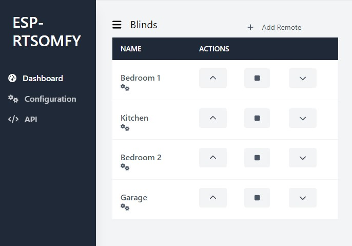

# SomfyController
Control Somfy blinds (with RTS Protocol) througt an Arduino Wemos D1.

It is based from the work of `Nickduino` at [Somfy_Remote](https://github.com/Nickduino/Somfy_Remote)

# Hardware
## Soldering
Solder a 433.42 MHz crystals to replace the one on a 433.92MHz transmitter. A RTL-SDR comes in handy to check the frequency and make sure the transmitter is working.

## Wiring


# Software
## First step
Once binaries (Core and UI) uploaded. Connect to the Hotspot `SomfyController Fallback Hotspot` (defined in includes/config.h). Use the password `5cKErSRCyQzy` (also defined in includes/config.h). Then, connect to `192.168.4.1` to setup your WiFi connection.

On the UI, you can `create`, `read`, `update` and `delete` remotes.

## UI
UI is build with HTML/CSS/JS. It use library like tailwind and alpine.js.


## OTA updates
TODO

# TODO
- [ ] Support non ASCII chars in names ?
- [ ] Add OTA
- [ ] Improve HTML part
- [ ] Create a HA integration

# Contributing
Pull requests are welcome. For major changes, please open an issue first to discuss what you would like to change.

# API
## REST

</details>

<details>
 <summary><code>POST</code> <code><b>/api/v1/system/restart</b></code> <code>(Resuqests a restart)</code></summary>

##### Parameters

> None

##### Responses

> | http code     | content-type                      | response                                                            |
> |---------------|-----------------------------------|---------------------------------------------------------------------|
> | `200`         | `application/json`                | `{"message":"Restart requested."}`                            |
> | `400`         | `application/json`                | `{"message":"error"}`                            |

##### Example cURL

> ```javascript
>  curl -X POST -H "application/x-www-form-urlencoded" http://192.168.4.1/api/v1/system/restart
> ```

</details>

<details>
 <summary><code>GET</code> <code><b>/api/v1/system/infos</b></code> <code>(Gets system informations)</code></summary>

##### Parameters

> None

##### Responses

> | http code     | content-type                      | response                                                            |
> |---------------|-----------------------------------|---------------------------------------------------------------------|
> | `200`         | `application/json`                | JSON string                                                         |

##### Example cURL

> ```javascript
>  curl -X GET -H "application/x-www-form-urlencoded" http://192.168.4.1/api/v1/system/infos
> ```

</details>

<details>
 <summary><code>GET</code> <code><b>/api/v1/wifi/networks</b></code> <code>(Gets scanned networks)</code></summary>

##### Parameters

> None

##### Responses

> | http code     | content-type                      | response                                                            |
> |---------------|-----------------------------------|---------------------------------------------------------------------|
> | `200`         | `application/json`                | JSON string                                                         |

##### Example cURL

> ```javascript
>  curl -X GET -H "application/x-www-form-urlencoded" http://192.168.4.1/api/v1/wifi/networks
> ```

</details>

<details>
 <summary><code>GET</code> <code><b>/api/v1/wifi/config</b></code> <code>(Gets WiFi configuration)</code></summary>

##### Parameters

> None

##### Responses

> | http code     | content-type                      | response                                                            |
> |---------------|-----------------------------------|---------------------------------------------------------------------|
> | `200`         | `application/json`                | JSON string                                                         |

##### Example cURL

> ```javascript
>  curl -X GET -H "application/x-www-form-urlencoded" http://192.168.4.1/api/v1/wifi/config
> ```

</details>

<details>
 <summary><code>POST</code> <code><b>/api/v1/wifi/config</b></code> <code>(Updates WiFi configuration)</code></summary>

##### Parameters

> | name      |  type      | data type               | description                                                           |
> |-----------|------------|-------------------------|-----------------------------------------------------------------------|
> | ssid      |  required  | string                  | The SSID of the network to connect  |
> | password  |  optional | string                  | The Password of the network to connect  |

##### Responses

> | http code     | content-type                      | response                                                            |
> |---------------|-----------------------------------|---------------------------------------------------------------------|
> | `200`         | `application/json`                | `{"ssid":"foo","password":"bar"}`                            |
> | `400`         | `application/json`                | `{"message":"error"}`                            |

##### Example cURL

> ```javascript
>  curl -X POST -H "application/x-www-form-urlencoded" -d "ssid=foo&password=bar" http://192.168.4.1/api/v1/wifi/config
> ```

</details>

<details>
 <summary><code>GET</code> <code><b>/api/v1/mqtt/config</b></code> <code>(Gets MQTT configuration)</code></summary>

##### Parameters

> None

##### Responses

> | http code     | content-type                      | response                                                            |
> |---------------|-----------------------------------|---------------------------------------------------------------------|
> | `200`         | `application/json`                | JSON string                                                         |

##### Example cURL

> ```javascript
>  curl -X GET -H "application/x-www-form-urlencoded" http://192.168.4.1/api/v1/mqtt/config
> ```

</details>

<details>
 <summary><code>POST</code> <code><b>/api/v1/mqtt/config</b></code> <code>(Updates MQTT configuration)</code></summary>

##### Parameters

> | name      |  type      | data type               | description                                                           |
> |-----------|------------|-------------------------|-----------------------------------------------------------------------|
> | enabled   |  required  | bool                  | Enable or not MQTT  |
> | broker    |  required  | string                | The MQTT server address  |
> | port      |  required  | int                   | The port of MQTT server  |
> | username  |  optional  | string                | Login to connect to the server  |
> | password  |  optional  | string                | Password to connect to the server  |

##### Responses

> | http code     | content-type                      | response                                                            |
> |---------------|-----------------------------------|---------------------------------------------------------------------|
> | `200`         | `application/json`                | `{"enabled":true, "broker": "", "port": 42, "username": "", "password":""}`                            |
> | `400`         | `application/json`                | `{"message":"error"}`                            |

##### Example cURL

> ```javascript
>  curl -X POST -H "application/x-www-form-urlencoded" -d "enabled=true&broker=bar&port=42&username=&password=" http://192.168.4.1/api/v1/mqtt/config
> ```

</details>

<details>
 <summary><code>GET</code> <code><b>/api/v1/remotes</b></code> <code>(Gets all registered remotes)</code></summary>

##### Parameters

> None

##### Responses

> | http code     | content-type                      | response                                                            |
> |---------------|-----------------------------------|---------------------------------------------------------------------|
> | `200`         | `application/json`                | JSON string                                                         |

##### Example cURL

> ```javascript
>  curl -X GET -H "application/x-www-form-urlencoded" http://192.168.4.1/api/v1/remotes
> ```

</details>

<details>
 <summary><code>POST</code> <code><b>/api/v1/remotes</b></code> <code>(Creates a new remote)</code></summary>

##### Parameters

> | name      |  type      | data type               | description                                                           |
> |-----------|------------|-------------------------|-----------------------------------------------------------------------|
> | name      |  required  | string                  | Name of the remote  |

##### Responses

> | http code     | content-type                      | response                                                            |
> |---------------|-----------------------------------|---------------------------------------------------------------------|
> | `201`         | `application/json`                | `{"name":"foo", "id": 42, "rolling_code": 42}`                            |
> | `400`         | `application/json`                | `{"message":"error"}`                            |

##### Example cURL

> ```javascript
>  curl -X POST -H "application/x-www-form-urlencoded" -d "name=foo" http://192.168.4.1/api/v1/remotes
> ```

</details>

<details>
 <summary><code>GET</code> <code><b>/api/v1/remotes/{remote_id}</b></code> <code>(Gets a specific remote)</code></summary>

##### Parameters

> None

##### Responses

> | http code     | content-type                      | response                                                            |
> |---------------|-----------------------------------|---------------------------------------------------------------------|
> | `200`         | `application/json`                | JSON string                                                         |
> | `400`         | `application/json`                | `{"message":"error"}`                            |

##### Example cURL

> ```javascript
>  curl -X GET -H "application/x-www-form-urlencoded" http://192.168.4.1/api/v1/remotes/0
> ```

</details>

<details>
 <summary><code>PATCH</code> <code><b>/api/v1/remotes/{remote_id}</b></code> <code>(Updates a remote)</code></summary>

##### Parameters

> | name          |  type      | data type               | description                                                           |
> |---------------|------------|-------------------------|-----------------------------------------------------------------------|
> | name          |  optional  | string                  | Name of the remote  |
> | rolling_code  |  optional  | int                  | Rolling code of the remote  (Not implemented yet) |

##### Responses

> | http code     | content-type                      | response                                                            |
> |---------------|-----------------------------------|---------------------------------------------------------------------|
> | `200`         | `application/json`                | `{"name":"foo", "id": 42, "rolling_code": 42}`                            |
> | `400`         | `application/json`                | `{"message":"error"}`                            |

##### Example cURL

> ```javascript
>  curl -X PATCH -H "application/x-www-form-urlencoded" -d "name=foo&rolling_code=0" http://192.168.4.1/api/v1/remotes/0
> ```

</details>

<details>
 <summary><code>DELETE</code> <code><b>/api/v1/remotes/{remote_id}</b></code> <code>(Deletes a remote)</code></summary>

##### Parameters

> None

##### Responses

> | http code     | content-type                      | response                                                            |
> |---------------|-----------------------------------|---------------------------------------------------------------------|
> | `200`         | `application/json`                | `{"name":"foo", "id": 42, "rolling_code": 42}`                            |
> | `400`         | `application/json`                | `{"message":"error"}`                            |

##### Example cURL

> ```javascript
>  curl -X DELETE -H "application/x-www-form-urlencoded" http://192.168.4.1/api/v1/remotes/0
> ```

</details>

<details>
 <summary><code>POST</code> <code><b>/api/v1/remotes/{remote_id}/action</b></code> <code>(Send a command with the remote)</code></summary>

##### Parameters

> | name      |  type      | data type               | description                                                           |
> |-----------|------------|-------------------------|-----------------------------------------------------------------------|
> | action    |  required  | string                  | Action to do. (up, down, stop, pair, reset)  |

##### Responses

> | http code     | content-type                      | response                                                            |
> |---------------|-----------------------------------|---------------------------------------------------------------------|
> | `200`         | `application/json`                | `{"message": "Command sent."}`                            |
> | `400`         | `application/json`                | `{"message":"error"}`                            |

##### Example cURL

> ```javascript
>  curl -X POST -H "application/x-www-form-urlencoded" -d "action=up" http://192.168.4.1/api/v1/remotes/0/action
> ```

</details>

## MQTT
### Publish
<summary><code><b>/esprtsomfy/system/infos/version</b></code> <code>(Gets Firmware version)</code></summary>
<summary><code><b>/esprtsomfy/system/infos/mac</b></code> <code>(Gets MAC Address)</code></summary>
<summary><code><b>/esprtsomfy/system/infos/ip</b></code> <code>(Gets IP Address)</code></summary>
<summary><code><b>/esprtsomfy/remotes/+/rolling_code</b></code> <code>(Gets the Rolling Code of a specific remote)</code></summary>
<summary><code><b>/esprtsomfy/remotes/+/name</b></code> <code>(Gets the Name of a specific remote)</code></summary>
<summary><code><b>/esprtsomfy/remotes/+/last_action</b></code> <code>(Gets the last action of a specific remote)</code></summary>

### Subscribe
<summary><code><b>/esprtsomfy/remotes/+/set/name</b></code> <code>(Updates the Name of a specific remote)</code></summary>
<summary><code><b>/esprtsomfy/remotes/+/set/action</b></code> <code>(Sends a command (up, stop, down, pair, reset) with the remote)</code></summary>
